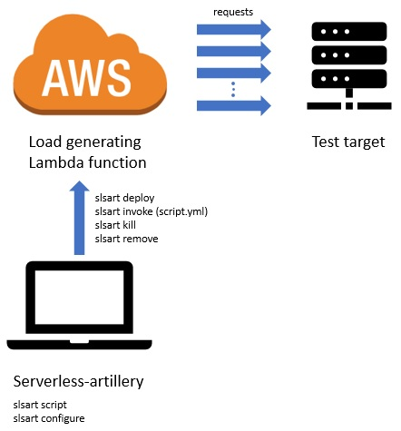

# Serverless-artillery [](https://travis-ci.org/Nordstrom/serverless-artillery) [](https://coveralls.io/github/Nordstrom/serverless-artillery?branch=master)

[//]: # (Thanks to https://www.divio.com/en/blog/documentation/)

# Introduction
Combine [`serverless`](https://serverless.com) with [`artillery`](https://artillery.io) and you get `serverless-artillery` (a.k.a. `slsart`). 

Serverless-artillery makes it easy to test your services for performance and functionality quickly, easily and without having to maintain any servers or testing infrastructure.

### Use serverless-artillery if
1. You want to know if your services (either internal or public) can handle different amount of traffic load (i.e. performance or load testing).
1. You want to test if your services behave as you expect after you deploy new changes (i.e. acceptance testing).
1. You want to constantly monitor your services over time to make sure the latency of your services is under control (i.e. monitoring mode).

# Table of Contents
- [Installation](#installation)
  - [Installing on local machine](#installing-on-local-machine)
    - [Prerequisite](#prerequisite)
      - [1. Node JS](#1-node-js)
      - [2. Serverless Framework CLI](#2-serverless-framework-cli)
    - [Installing serverless-artillery](#installing-serverless-artillery)
  - [Installing in Docker](#installing-in-docker)
- [Uninstallation](#uninstallation)
- [How it works?](#how-it-works)
  - [Load generator Lambda function on AWS](#load-generator-lambda-function-on-aws)
- [Before running serverless-artillery](#before-running-serverless-artillery)
  - [Setup for Nordstrom Technology](#setup-for-nordstrom-technology)
  - [Setup for everyone else](#setup-for-everyone-else)
- [Tutorial 1: Run a quick performance test](#tutorial-1-run-a-quick-performance-test)
  - [1. Setup AWS account credentials](#1-setup-aws-account-credentials)
  - [2. Command line](#2-command-line)
  - [3. Deploy](#3-deploy)
  - [4. Invoke](#4-invoke)
  - [5. Remove](#5-remove)
- [Tutorial 2: Performance test with custom script](#tutorial-2-performance-test-with-custom-script)
  - [1. Create new directory](#1-create-new-directory)
  - [2. Create `script.yml`](#2-create-scriptyml)
  - [3. Understanding `script.yml`](#3-understanding-scriptyml)
  - [4. Customizing `script.yml`](#4-customizing-scriptyml)
  - [5. Setup AWS account credentials](#5-setup-aws-account-credentials)
  - [6. Deploy assets to AWS](#6-deploy-assets-to-aws)
  - [7. Invoke performance test](#7-invoke-performance-test)
  - [8. Remove assets from AWS](#8-remove-assets-from-aws)
- [Tutorial 3: Performance test with custom deployment assets](#tutorial-3-performance-test-with-custom-deployment-assets)
  - [1. Create new directory](#1-create-new-directory-1)
  - [2. Create `script.yml`](#2-create-scriptyml)
  - [3. Understanding `script.yml`](#3-understanding-scriptyml)
  - [4. Customizing `script.yml`](#4-customizing-scriptyml)
  - [5. Create custom deployment assets](#5-create-custom-deployment-assets)
  - [6. Understanding `serverless.yml`](#6-understanding-serverlessyml)
    - [a. Service name](#a-service-name)
    - [b. Load generator Lambda function name](#b-load-generator-lambda-function-name)
    - [c. Load generator Lambda function permissions](#c-load-generator-lambda-function-permissions)
  - [7. Customizing `serverless.yml`](#7-customizing-serverlessyml)
    - [a. Customization for Nordstrom Engineers](#a-customization-for-nordstrom-engineers)
    - [b. Service name](#b-service-name)
    - [c. Plugins](#c-plugins)
      - [i. CloudWatch plugin](#i-cloudwatch-plugin)
      - [ii. Datadog plugin](#ii-datadog-plugin)
  - [8. Setup AWS account credentials](#8-setup-aws-account-credentials)
  - [9. Deploy assets to AWS](#9-deploy-assets-to-aws)
  - [10. Invoke performance test](#10-invoke-performance-test)
  - [11. Remove assets from AWS](#11-remove-assets-from-aws)
- [Tutorial 4: Killing in-progress performance test](#tutorial-4-killing-in-progress-performance-test)
  - [1. Increase `duration`](#1-increase-duration)
  - [2. Setup AWS account credentials](#2-setup-aws-account-credentials)
  - [3. Deploy assets to AWS](#3-deploy-assets-to-aws)
  - [4. Invoke performance test](#4-invoke-performance-test)
  - [5. Kill the in-progress performance test](#5-kill-the-in-progress-performance-test)
  - [6. Wait before re-deploying](#6-wait-before-re-deploying)
- [Performance test workshop](#performance-test-workshop)
- [Other commands and use cases](#other-commands-and-use-cases)
  - [Killing in-progress performance test](#killing-in-progress-performance-test)
  - [Create customized `script.yml`](#create-customized-scriptyml)
  - [Performance test using script file with different name/path](#performance-test-using-script-file-with-different-namepath)
  - [Reserved and unsupported flags](#reserved-and-unsupported-flags)
    - [Reserved flags](#reserved-flags)
    - [Unsupported flags](#unsupported-flags)
  - [Providing a data store to view the results of your performance test](#providing-a-data-store-to-view-the-results-of-your-performance-test)
  - [Related tools and plugins](#related-tools-and-plugins)
  - [Performance testing VPC hosted services](#performance-testing-vpc-hosted-services)
  - [Using Payload/CSV files to inject data in scenarios of your `script.yml`](#using-payloadcsv-files-to-inject-data-in-scenarios-of-your-scriptyml)
  - [Advanced customization use cases](#advanced-customization-use-cases)
    - [Deployment assets and settings customization](#deployment-assets-and-settings-customization)
    - [Test script and execution customization using Artillery.io](#test-script-and-execution-customization-using-artilleryio)
    - [Script splitting customization](#script-splitting-customization)
    - [Debugging and Tracing Behavior Customization](#debugging-and-tracing-behavior-customization)
      - [`_trace`](#_trace)
      - [`_simulation`](#_simulation)
    - [Splitting and Distribution Logic Customization](#splitting-and-distribution-logic-customization)
      - [Scripts](#scripts)
      - [Splitting](#splitting)
- [Acceptance mode](#acceptance-mode)
  - [`match` clause](#match-clause)
  - [Acceptance test command](#acceptance-test-command)
  - [Tutorial 5: Acceptance mode](#tutorial-5-acceptance-mode)
    - [1. Customize `script.yml`](#1-customize-scriptyml)
    - [2. Setup AWS account credentials](#2-setup-aws-account-credentials-1)
    - [3. Deploy assets to AWS](#3-deploy-assets-to-aws-1)
    - [4. Invoke acceptance test](#4-invoke-acceptance-test)
    - [5. Observe the results](#5-observe-the-results)
    - [6. Test failure scenario](#6-test-failure-scenario)
      - [6.1. Edit `script.yml` to fail `match`](#61-edit-scriptyml-to-fail-match)
      - [6.2. Invoke acceptance test](#62-invoke-acceptance-test)
      - [6.3. Observe the results](#63-observe-the-results)
    - [7. Remove assets from AWS](#7-remove-assets-from-aws)
  - [More about acceptance mode](#more-about-acceptance-mode)
    - [Acceptance testing in CI/CD](#acceptance-testing-in-cicd)
    - [Run `script.yml` exclusively in acceptance mode](#run-scriptyml-exclusively-in-acceptance-mode)
    - [Use same `script.yml` for performance and acceptance testing and monitoring](#use-same-scriptyml-for-performance-and-acceptance-testing-and-monitoring)
    - [To configure acceptance behavior](#to-configure-acceptance-behavior)
- [Monitoring mode](#monitoring-mode)
  - [Tutorial 6: Monitoring mode without serverless-artillery alert](#tutorial-6-monitoring-mode-without-serverless-artillery-alert)
    - [1. Create custom deployment assets](#1-create-custom-deployment-assets)
    - [2. Setup AWS account credentials](#2-setup-aws-account-credentials-2)
    - [3. Tryout monitoring mode](#3-tryout-monitoring-mode)
      - [3.1. Deploy assets to AWS](#31-deploy-assets-to-aws)
      - [3.2. Invoke monitoring once](#32-invoke-monitoring-once)
    - [4. Customize deployment assets to turn on monitoring](#4-customize-deployment-assets-to-turn-on-monitoring)
    - [5. Deploy assets to AWS to start monitoring](#5-deploy-assets-to-aws-to-start-monitoring)
    - [6. Pause monitoring](#6-pause-monitoring)
      - [6.1. Method 1: Using CloudWatch Rules](#61-method-1-using-cloudwatch-rules)
      - [6.2. Method 2: Turn monitoring off in `serverless.yml`](#62-method-2-turn-monitoring-off-in-serverlessyml)
    - [7. Remove assets from AWS](#7-remove-assets-from-aws-1)
  - [Tutorial 7: Monitoring mode with serverless-artillery alert](#tutorial-7-monitoring-mode-with-serverless-artillery-alert)
    - [1. Create custom deployment assets](#1-create-custom-deployment-assets-1)
    - [2. Setup AWS account credentials](#2-setup-aws-account-credentials-3)
    - [3. Customize script to have `match` clause](#3-customize-script-to-have-match-clause)
    - [4. Customize deployment assets to add at least one subscription](#4-customize-deployment-assets-to-add-at-least-one-subscription)
    - [5. Tryout monitoring mode](#5-tryout-monitoring-mode)
      - [5.1. Deploy assets to AWS](#51-deploy-assets-to-aws)
      - [5.2. Invoke monitoring once](#52-invoke-monitoring-once)
    - [6. Test failure scenario](#6-test-failure-scenario-1)
      - [6.1. Edit `script.yml` to fail `match`](#61-edit-scriptyml-to-fail-match-1)
      - [6.2. Invoke monitoring once](#62-invoke-monitoring-once)
    - [7. Customize deployment assets to turn on monitoring](#7-customize-deployment-assets-to-turn-on-monitoring)
    - [8. Deploy assets to AWS to start monitoring](#8-deploy-assets-to-aws-to-start-monitoring)
    - [9. Pause monitoring](#9-pause-monitoring)
    - [10. Remove assets from AWS](#10-remove-assets-from-aws)
  - [More about monitoring mode](#more-about-monitoring-mode)
    - [Run `script.yml` exclusively in monitoring mode](#run-scriptyml-exclusively-in-monitoring-mode)
    - [Use same `script.yml` for performance and acceptance testing and monitoring](#use-same-scriptyml-for-performance-and-acceptance-testing-and-monitoring-1)
    - [To configure monitoring behavior](#to-configure-monitoring-behavior)
- [Upgrading customized projects built with older versions of serverless-artillery](#upgrading-customized-projects-built-with-older-versions-of-serverless-artillery)
  - [Known Upgrade Issues](#known-upgrade-issues)
- [Detailed Usage](#detailed-usage)
  - [Commands](#commands)
    - [`deploy`](#deploy)
    - [`invoke`](#invoke)
    - [`kill`](#kill)
    - [`remove`](#remove)
    - [`script`](#script)
    - [`configure`](#configure)
    - [`upgrade`](#upgrade)
- [Troubleshooting](#troubleshooting)
  - [Problems installing?](#problems-installing)
- [External References](#external-references)
- [If you've read this far](#if-youve-read-this-far)

# Installation

## Installing on local machine
You can install serverless-artillery on your local machine as follows.
### Prerequisite
#### 1. Node JS
Before installing serverless-artillery, install Node JS from https://nodejs.org/en/download/ or with your operating system’s package manager. You can install the latest LTS version. We support any version higher than maintenance LTS (v8+).
#### 2. Serverless Framework CLI
Before installing serverless-artillery, install Serverless Framework CLI (a.k.a. Serverless) (v1.38+). It should be either installed globally or available in the local node_modules. To install globally use the following command.
```
npm install -g serverless
```

### Installing serverless-artillery
Now you can install serverless-artillery on your local machine using the following command.
```
npm install -g serverless-artillery
```
To check that the installation succeeded, run:
```
slsart --version
```
You should see serverless-artillery print its version if the installation has been successful.

## Installing in Docker
If you prefer using Docker, refer to [example Dockerfile](Dockerfile) for installation. Please note that, post installation causes permission issues when installing in a Docker image. To successfully install in Docker make sure to add the following to your Dockerfile before the Serverless Framework CLI (a.k.a. Serverless) and serverless-artillery install.
```
ENV NPM_CONFIG_PREFIX=/home/node/.npm-global
ENV PATH=$PATH:/home/node/.npm-global/bin
```

# Uninstallation
When needed, you can uninstall serverless-artillery from you local machine using the following command.
```
npm uninstall -g serverless-artillery
```

# How it works?


* Serverless-artillery would be installed and run on your local machine. From command line run `slsart --help` to see various serverless-artillery commands.
* It takes your JSON or YAML load script (`script.yml`) that specifies 
  * test target/URL/endpoint/service
  * load progression
  * and the scenarios that are important for your service to test.
* When you run `slsart deploy` command, serverless-artillery deploys a **load generator Lambda function**, on your AWS account along with other assets.
* Running the tests
  * **Performance test:** When you run `slsart invoke` command, serverless-artillery would invoke the load generator Lambda function.
    * It would generate the number of requests as specified in `script.yml` to specified test target in order to run the specified scenarios.
  * **Acceptance test:** When you run `slsart invoke -a` command, serverless-artillery would invoke the load generator Lambda function in acceptance test mode where it runs each scenario in your script exactly once and reports the results.
  * **Monitoring:** When you customize the deployment assets to turn on monitoring and deploy those assets using `slsart deploy` command, the load generator Lambda function is invoked in monitoring mode once a minute 24x7 where it runs each scenario in your script 5 times and sends an alert if it detects a problem. 
* When you run `slsart remove` command, serverless-artillery would remove these assets from your AWS account.
* When you run `slsart kill` command, serverless-artillery would kill the in-progress test and remove these assets from your AWS account.

## Technologies powering serverless-artillery
<details><summary>Click to expand/collapse</summary>
<p>

### Serverless Framework
- The [Serverless Framework](https://serverless.com) makes managing (deploying/updating/removing) cloud assets easy.
- It translates a `yaml` file to deployable assets of the target cloud provider (like AWS).
- Serverless-artillery uses it to manage required assets to your cloud account.

### Artillery.io
- [Artillery.io](https://artillery.io/) (built by Hassy Veldstra of shoreditch-ops) is an existing open-source node package, built for easy load testing and functional testing of a target/service/endpoint/URL. It provides a simple but powerful means of specifying how much load to create and what requests that load should comprise.
- It takes in a developer-friendly JSON or YAML load script that specifies 
  - target/URL/endpoint
  - load progression
  - and the scenarios that are important for your service to test.
- It generates specified load, and measures and reports the resulting latency and return codes.
- It generates the load by running on your local machine or servers.
- However, if you specify more load in your script than what can be produced on your machine, artillery will throttle down the load specified in your script. While it is simple to distribute artillery across a fleet of servers, you must then manage, coordinate, and retire them. It is not a serverless solution. This is the task that serverless-artillery steps in to remove from your plate.

### Serverless-artillery
- Serverless-artillery allows your script to specify an amount of load far exceeding the capacity of a single server to execute.
- It breaks that script into smaller chunks (sized for a single instance of load generator Lambda function) and distribute the chunks for execution across multiple instances of load generator Lambda function.
- Since this is done using a FaaS provider, the ephemeral infrastructure used to execute your load disappears as soon as your load tests are complete.

</p>
</details>

## Load generator Lambda function on AWS
<details><summary>Click to expand/collapse</summary>
<p>


- Serverless-artillery generates the requests to run the specified tests using load generator Lambda function, which is deployed and invoked on AWS along with other assets.
  -  Naming format is `<customized-service-name default:serverless-artillery>-<optional-unique-string-><stage default:dev>-loadGenerator`. For example, `serverless-artillery-dev-loadGenerator` or `serverless-artillery-XnBa473psJ-dev-loadGenerator`.
- It has an ephimeral architecture. It only exists as long as you need it.
- It runs Artillery.io node package in AWS Lambda function.
  - Each lambda function can only generate a certain amount of load, and can only run for up to five minutes (five minutes was a built-in limitation of AWS Lambda. Now it has been raised to 15 minutes). 
  - Given these limitations, it is often necessary to invoke more lambdas - both to scale horizontally (to generate higher load) as well as handing off the work to a new generation of lambdas before their run-time has expired.
- Above diagram shows how Serverless Artillery solves this problem.
  - It first runs the Lamdba function in a **controller** mode. It examines the submitted load config JSON/YAML script (this is identical to the original “servered” [Artillery.io](https://artillery.io/) script). This script is also referred to as original script. If the load in the original script exceeds what a single lambda is configured to handle, then the load config is chopped up into workloads achievable by a single lambda.
  - Controller lambda then invokes as many **worker** lambdas as necessary to generate the load. Controller lambda passes a script to worker lambda that is created by chopping up the original script.
  - Towards the end of the Lambda runtime the controller lambda invokes a new controller lambda to produce load for the remaining duration.
- The result of the load test can be reported to CloudWatch, InfluxDB or Datadog through plugins and then visualized with CloudWatch, Grafana or Datadog dashboard.

</p>
</details>

# Before running serverless-artillery
Serverless-artillery needs to _deploy_ assets like [load generator Lambda function](#load-generator-lambda-function-on-aws) to AWS, _invoke_ the function to run the tests and _remove_ these assets from AWS when not needed. Hence you need an AWS account and setup credentials with which to deploy, invoke and remove the assets from AWS.

## Setup for Nordstrom Technology
If you are a **_Nordstrom_** engineer, please see the page titled **_`Serverless Artillery - Nordstrom Technology Setup`_** in **Confluence** and follow the instructions there.
## Setup for everyone else
In order to use serverless-artillery, depending on the AWS account environment you're working in, you may need to define `AWS_PROFILE` to declare the AWS credentials to use and possibly `HTTP_PROXY` in order to escape your corporate proxy.  See the [Serverless Framework docs](https://serverless.com/framework/docs/) or serverless-artillery workshop's [Lesson 0](https://github.com/Nordstrom/serverless-artillery-workshop/tree/master/Lesson0%20-%20Before%20the%20workshop) followed by [**Step 1** of Lesson 1](https://github.com/Nordstrom/serverless-artillery-workshop/tree/master/Lesson1%20-%20Hello%2C%20artillery#step-1-serverless-artillery-requires-aws-credentials) for details of how to set your local machine for successful deployment, invocation, and removal of assets from your AWS accounts. 

# Performance mode (performance/load testing)
You can use serverless-artillery to performance test or load test your service/target/endpoint/URL. Performance testing framework forms the basis of the other two modes of serverless-artillery, i.e. acceptance mode and monitoring mode.

## Tutorial 1: Run a quick performance test
If you want to quickly test your setup or see serverless-artillery in action, do the following to quickly run a **small load/performance test**.

### 1. Setup AWS account credentials
Make sure you have [setup your AWS account credentials](#before-running-serverless-artillery) before proceeding.

### 2. Command line
Go to command line for all the following steps in this tutorial. You can run the steps of this tutorial from anywhere in command line since the commands you run in this tutorial will not create any files on your local machine.

### 3. Deploy
The `slsart deploy` command deploys required assets (like [load generator Lambda function](#load-generator-lambda-function-on-aws)) to the AWS account you selected in the previous step. 

By _default_ it uses `service` name `serverless-artillery` and `stage` name `dev`. And hence the _default_ AWS CloudFormation Stack name becomes `serverless-artillery-dev` (format: `<service-name default:serverless-artillery>-<stage-name default:dev>`). You will see that if you go to your AWS account console > CloudFormation after running the command.

Since multiple developers could share an AWS account, we recommend creating a unique stack for your use. For that we recommend either using custom deployment assets as shown in [Tutorial 3](#tutorial-3-performance-test-with-custom-deployment-assets) or use the _optional_ `stage` argument as shown in the following command.
```
slsart deploy --stage <your-unique-stage-name>
```
The AWS CloudFormation Stack name would be `serverless-artillery-<your-unique-stage-name>`.

For example,
```
slsart deploy --stage test1
```
The AWS CloudFormation Stack name in this case would be `serverless-artillery-test1`. 

### 4. Invoke
The following command will invoke [load generator Lambda function](#load-generator-lambda-function-on-aws) using the default load script (`script.yml`), creating small traffic against the sample endpoint specified in the default script. Note that this default load script is part of the global install of serverless-artillery and not in the local folder from where you are running the command.
```
slsart invoke --stage <your-unique-stage-name>
```
At the end of the test serverless-artillery will generate a report of the test. **Please note that this report is generated only for small load.** See [here](#providing-a-data-store-to-view-the-results-of-your-performance-test) for details.

If you go to AWS Lambda console > find the `loadGenerator` Lambda corresponding to your stack > `Monitoring` tab > `Invocations` graph, you will see that the Lambda function was invoked to generate the load. You can also see the logs produced by the Lambda in CloudWatch Logs.

### 5. Remove
The following command will remove the AWS CloudFormation Stack deployed in step 3. If you are a **_Nordstrom_** engineer, please see the page titled **_`Serverless Artillery - Remove Instructions`_** in **Confluence** and follow the instructions there.
```
slsart remove --stage <your-unique-stage-name>
```

## Tutorial 2: Performance test with custom script
Throughout this tutorial we will walk you towards performance testing the AWS website, https://aws.amazon.com/.

We would test with our _custom_ script but would use _default_ deployment assets.

### 1. Create new directory
Start by creating a new directory for this tutorial and go to that directory in command line.

### 2. Create `script.yml`
Serverless-artillery needs to know information about the performance test that user wants to run. It needs information like, the target URL of the service that user wants to test, load progression, user's interaction with the service (scenarios) etc. All these are described in a `yml` file. It is the same `yml` that Artillery.io uses. 
- **Please see [here for basic concepts for Artillery.io usage](https://artillery.io/docs/basic-concepts/#basic-concepts).**
- **Please see [here for Artillery.io's test script reference](https://artillery.io/docs/script-reference/).**

Run the following command to create the initial `script.yml` file.
```
slsart script
```

### 3. Understanding `script.yml`
Open `script.yml` with your favorite editor to see what it contains.
<details><summary>Click to expand/collapse</summary>
<p>

```
# Thank you for trying serverless-artillery!
# This default script is intended to get you started quickly.
# There is a lot more that Artillery can do.
# You can find great documentation of the possibilities at:
# https://artillery.io/docs/
config:
  # this hostname will be used as a prefix for each URI in the flow unless a complete URI is specified
  target: "http://aws.amazon.com"
  phases:
    -
      duration: 5
      arrivalRate: 2
scenarios:
  -
    flow:
      -
        get:
          url: "/"

```

</p>
</details>

- The script has [`config` block](https://artillery.io/docs/script-reference/#the-config-section)
  - under which it specifies http://aws.amazon.com as the `target` for the test
    - and that requests should be made using [HTTP protocol](https://artillery.io/docs/http-reference/)
  - There is one [load `phase`](https://artillery.io/docs/script-reference/#load-phases) of `duration` of 5 sec and `arrivalRate` of 2 new virtual users arriving every second.
- The script has [`scenarios` block](https://artillery.io/docs/script-reference/#scenarios)
  - which contains one scenario
    - which contains one flow
      - which has one [flow action](https://artillery.io/docs/http-reference/#flow-actions) to send [GET request](https://artillery.io/docs/http-reference/#get-post-put-patch-delete-requests) for the specified `target`.

### 4. Customizing `script.yml`
This step is optional in the tutorial. If you like you can customize `script.yml` as follows.
- If you have a public endpoint/service/URL that you would like to load test then you can change `target` to point to that.
- You can also change the [load `phase`](https://artillery.io/docs/script-reference/#load-phases) and [`scenarios` block](https://artillery.io/docs/script-reference/#scenarios) as per your need. We recommend using a low load to try the tool first.

### 5. Setup AWS account credentials
Make sure you have [setup your AWS account credentials](#before-running-serverless-artillery) before proceeding.

### 6. Deploy assets to AWS
This section is same as before. See [here](#3-deploy) for details.

### 7. Invoke performance test
Now you are all set to invoke performance test using following command.
```
slsart invoke --stage <your-unique-stage-name>
```

At the end of the test serverless-artillery will generate a report of the test. **Please note that this report is generated only for small load.** See [here](#providing-a-data-store-to-view-the-results-of-your-performance-test) for details.

If you go to AWS Lambda console > find the `loadGenerator` Lambda corresponding to your stack > `Monitoring` tab > `Invocations` graph, you will see that the Lambda function was invoked to generate the load. You can also see the logs produced by the Lambda in CloudWatch Logs.

**NOTE** that for performance testing, the command will take the `script.yml` from your local machine (and not the one deployed in AWS account) to run the performance test. Hence if you edit it on your local machine after deploying assets to AWS, you don't need to deploy again in order to run the performance test again. Also note that this is true only for performance test and acceptance test and not monitoring.

### 8. Remove assets from AWS
After the test is done, you can remove the assets from AWS using following command. If you are a **_Nordstrom_** engineer, please see the page titled **_`Serverless Artillery - Remove Instructions`_** in **Confluence** and follow the instructions there.
```
slsart remove --stage <your-unique-stage-name>
```

## Tutorial 3: Performance test with custom deployment assets

Throughout this tutorial we will walk you towards performance testing the AWS website, https://aws.amazon.com/.

We would test with our _custom_ script and _custom_ deployment assets.

### 1. Create new directory
Start by creating a new directory for this tutorial and go to that directory in command line.

### 2. Create `script.yml`
This section is same as before. See [here](#2-create-scriptyml) for details.

### 3. Understanding `script.yml`
This section is same as before. See [here](#3-understanding-scriptyml) for details.

### 4. Customizing `script.yml`
This section is same as before. See [here](#4-customizing-scriptyml) for details.

### 5. Create custom deployment assets
Create a _local copy_ of the deployment assets for your customization and then deployment to AWS, using following command. The command generates a local copy of the load generator lambda function code (along with other assets) that can be edited and deployed with your changed settings if needed. It also runs `npm install` after creating local copy of the deployment assets.
```
slsart configure
```
The important files among other files created by this command are as follows.

|File|Description|
|:----|:----------|
|`package.json`|Node.js dependencies for the load generator Lambda. Add Artillery.io plugins you want to use here.|
|`serverless.yml`|Serverless-artillery's service definition/configuration using Serverless Framework. Change AWS-specific settings here.|
|`handler.js`|Load generator Lambda code. **EDIT AT YOUR OWN RISK.**|

**Note** that everytime you make changes to these local copy of deployment assets or `serverless.yml` file, you need to redeploy using `slsart deploy` command.

**Note** that if you change `package.json` then you need to run `npm install` and then redeploy using `slsart deploy` command.

### 6. Understanding `serverless.yml`
`serverless.yml` contains serverless-artillery's service definition/configuration using Serverless Framework.

Open `serverless.yml` with your favorite editor to see what it contains.
<details><summary>Click to expand/collapse</summary>
<p>

```
# We're excited that this project has provided you enough value that you are looking at its code!
#
# This is a standard [Serverless Framework](https://www.serverless.com) project and you should
# feel welcome to customize it to your needs and delight.
#
# If you do something super cool and would like to share the capability, please open a PR against
# https://www.github.com/Nordstrom/serverless-artillery
#
# Thanks!

# If the following value is changed, your service may be duplicated (this value is used to build the CloudFormation
# Template script's name)
service: serverless-artillery-XnBa473psJ

provider:
  name: aws
  runtime: nodejs8.10
  iamRoleStatements:
    # This policy allows the function to invoke itself which is important if the script is larger than a single
    # function can produce
    - Effect: 'Allow'
      Action:
        - 'lambda:InvokeFunction'
      Resource:
        'Fn::Join':
          - ':'
          -
            - 'arn:aws:lambda'
            - Ref: 'AWS::Region'
            - Ref: 'AWS::AccountId'
            - 'function'
            - '${self:service}-${opt:stage, self:provider.stage}-loadGenerator*' # must match function name
    # This policy allows the function to publish notifications to the SNS topic defined below with logical ID monitoringAlerts
    - Effect: 'Allow'
      Action:
        - 'sns:Publish'
      Resource:
        Ref: monitoringAlerts # must match the SNS topic's logical ID
functions:
  loadGenerator: # !!Do not edit this name!!
    handler: handler.handler    # the serverlessArtilleryLoadTester handler() method can be found in the handler.js source file
    timeout: 300                # set timeout to be 5 minutes (max for Lambda)
    environment:
      TOPIC_ARN:
        Ref: monitoringAlerts
      TOPIC_NAME:
        'Fn::GetAtt':
          - monitoringAlerts
          - TopicName
    events:
      - schedule:
          name: '${self:service}-${opt:stage, self:provider.stage}-monitoring' # !!Do not edit this name!!
          description: The scheduled event for running the function in monitoring mode
          rate: rate(1 minute)
          ########################################################################################################################
          ### !! BEFORE ENABLING... !!!
          ### 0. Change `'>>': script.yml` below to reference the script you want to use for monitoring if that is not its name.
          ###    The script must be in this directory or a subdirectory.
          ### 1. Modify your `script.yml` to provide the details of invoking every important surface of your service, as per
          ###    https://artillery.io/docs
          ### 2. Add a `match` clause to your requests, specifying your expectations of a successful request.  This relatively
          ###    undocumented feature is implemented at: https://github.com/shoreditch-ops/artillery/blob/82bdcdfc32ce4407bb197deff2cee13b4ecbab3b/core/lib/engine_util.js#L318
          ###    We would welcome the contribution of a plugin replacing this as discussed in https://github.com/Nordstrom/serverless-artillery/issues/116
          ### 3. Modify the `monitoringAlerts` SNS Topic below, uncommenting `Subscription` and providing subscriptions for any
          ###    alerts that might be raised by the monitoring function.  (To help you out, we've provided commented-out examples)
          ###    (After all, what good is monitoring if noone is listening?)
          ### 4. Deploy your new assets/updated service using `slsart deploy`
          ### 5. [As appropriate] approve the subscription verifications for the SNS topic that will be sent following its creation
          ########################################################################################################################
          enabled: false
          input:
            '>>': script.yml
            mode: monitoring
resources:
  Resources:
    monitoringAlerts: # !!Do not edit this name!!
      Type: 'AWS::SNS::Topic'
      Properties:
        DisplayName: '${self:service} Monitoring Alerts'
#        Subscription: # docs at https://docs.aws.amazon.com/AWSCloudFormation/latest/UserGuide/aws-properties-sns-subscription.html
#          - Endpoint: http://<host>/<path> # the endpoint is an URL beginning with "http://"
#            Protocol: http
#          - Endpoint: https://<host>/<path> # the endpoint is a URL beginning with "https://"
#            Protocol: https
#          - Endpoint: <target>@<host> # the endpoint is an email address
#            Protocol: email
#          - Endpoint: <target>@<host> # the endpoint is an email address
#            Protocol: email-json
#          - Endpoint: <phone-number> # the endpoint is a phone number of an SMS-enabled device
#            Protocol: sms
#          - Endpoint: <sqs-queue-arn> # the endpoint is the ARN of an Amazon SQS queue
#            Protocol: sqs
#          - Endpoint: <endpoint-arn> # the endpoint is the EndpointArn of a mobile app and device.
#            Protocol: application
#          - Endpoint: <lambda-arn> # the endpoint is the ARN of an AWS Lambda function.
#            Protocol: lambda
```

</p>
</details>

Please refer to [`serverless.yml` documentation](https://serverless.com/framework/docs/providers/aws/guide/serverless.yml/) for details. It defines assets needed for monitoring (turned off by default) as well which we will discuss later.
#### a. Service name
- In above `serverless.yml` the `service` name is set to `serverless-artillery-XnBa473psJ`. In your `serverless.yml` the string at the end (`XnBa473psJ`) would be different.
- This will be the AWS CloudFormation stack name when you run `slsart deploy`. Format of the AWS CloudFormation stack name would be `<service-name default:serverless-artillery>-<stage-name default:dev>`.
  - If you specify the optional stage name with the deploy command, i.e. `slsart deploy --stage <your-unique-stage-name>`, then the AWS CloudFormation stack name would be `<service-name default:serverless-artillery>-<your-unique-stage-name>`
- The `slsart configure` command adds a random string at the end of the `service` name so you get a unique stack name that does not conflict with anyone else also deploying to the same AWS account, in case you were to not specify the optional stage name with the deploy command.
- You can change `service` name to some other unique string as per your need. For example, `serverless-artillery-myperftestservice` or `myloadtestservice`.
- The rest of the `serverless.yml` refers to the service name by using `${self:service}`.

#### b. [Load generator Lambda function](#load-generator-lambda-function-on-aws) name
The Serverless Framework automatically names the Lambda function based on the service, stage and function name as follows.
- The function `loadGenerator` when deployed is named as `${self:service}-${opt:stage, self:provider.stage}-loadGenerator`.
  - `${self:service}` is name of the service. In this `serverless.yml` it is `serverless-artillery-XnBa473psJ`.
  - `${opt:stage, self:provider.stage}` will either use `${opt:stage}` or `${self:provider.stage}`.
    - `${opt:stage}` refers to the (optional) stage name passed in `slsart deploy [--stage <stage-name>]` command. For example, if you run `slsart deploy --stage prod` then `prod` would be used for `${opt:stage}`.
    - If no stage name is passed in the deploy command then `${self:provider.stage}` would be used. It is the `stage` name set under `provider` block in the `serverless.yml`. If one is not provided (like in above example) it is set to `dev`. See [here](https://serverless.com/framework/docs/providers/aws/guide/serverless.yml/).
- In this example function name will be set to `serverless-artillery-XnBa473psJ-dev-loadGenerator` while running `slsart deploy` command (note no stage name specified).
#### c. [Load generator Lambda function](#load-generator-lambda-function-on-aws) permissions
- In order to generate load the load generator Lambda needs to invoke itself.
- The `iamRoleStatements` block in the `serverless.yml` gives the load generator Lambda function to invoke itself (`lambda:InvokeFunction`).

### 7. Customizing `serverless.yml`
**NOTE:** Except for [one step for **_Nordstrom_** Engineers](#a-customization-for-nordstrom-engineers), all customizations are **optional** in the tutorial.

If you like you can customize `serverless.yml` as follows.

#### a. Customization for Nordstrom Engineers
If you are a **_Nordstrom_** engineer, please see the page titled **_`Serverless Artillery - Nordstrom Technology Policies`_** in **Confluence** and follow the instructions there.

#### b. Service name
- You can change `service` name to some other unique string as per your need.
- For example, `serverless-artillery-myperftestservice` or `myloadtestservice`.
- Format of the AWS CloudFormation stack name would be `<service-name default:serverless-artillery>-<stage-name default:dev>` after you deploy.

#### c. Plugins
You can customize the `serverless.yml` to use required tools/plugins mentioned [below](#related-tools-and-plugins). 

##### i. CloudWatch plugin
In this tutorial you can add [artillery-plugin-cloudwatch](https://github.com/Nordstrom/artillery-plugin-cloudwatch) to record test results to [AWS CloudWatch](https://aws.amazon.com/cloudwatch).
1. To allow the Lambda code to write to CloudWatch, the correct NPM package dependency must be added. This modifies the package.json file to include the necessary dependency.
```
npm install --save artillery-plugin-cloudwatch
```

2. In `script.yml`, at the end of the `config` block (which already exists)
```
config:
```
add CloudWatch plugin as follows:
```
  plugins:
    cloudwatch:
      namespace: "<cloud-watch-namespace>"
```
For example, you can use
```
      namespace: "serverless-artillery-myperftestservice-loadtest"
```

3. In `serverless.yml`, at the end of the following block (which already exists)
```
provider:
  iamRoleStatements:
```
add the following:
```
    - Effect: 'Allow'
      Action:
        - 'cloudwatch:PutMetricData'
      Resource:
        - '*'
```
##### ii. Datadog plugin
In this tutorial you can add [artillery-plugin-datadog](https://www.npmjs.com/package/artillery-plugin-datadog) to record test results to [Datadog](https://www.datadoghq.com/).

1. To allow the Lambda code to write to Datadog, the correct NPM package dependency must be added. This modifies the package.json file to include the necessary dependency.
```
npm install --save artillery-plugin-datadog
```

2. Update the `config` portion of `script.yml` to add Datadog plugin as follows and customize the `host`, `prefix` and `tags` as per your requirement.
```
config:
  plugins:
    datadog:
      # Custom hostname (leave blank if not desired) 
      host: ''
      # Custom metric prefix (example, to 'serverless-artillery') 
      prefix: 'serverless-artillery'
      # Additional tags for all metrics 
      tags:
        - 'mode:test'
```

3. In `serverless.yml`, under `provider` section specify Datadog API key as an environment variable as follows. **NOTE** that you should not save sensitive information like Datadog API Key in plain text in a source control. Below is just for the tutorial.
```
provider:
  environment:
    DATADOG_API_KEY: "<your-datadog-api-key>"
```

### 8. Setup AWS account credentials
This section is same as before. See [here](#before-running-serverless-artillery) for details.

### 9. Deploy assets to AWS
This section is same as before. See [here](#3-deploy) for details.

You can go to your AWS account console > CloudFormation, and see AWS stack `<service-name default:serverless-artillery>-<stage-name default:dev>` created there depending on the customizations explained in the steps above.

### 10. Invoke performance test
This section is same as before. See [here](#7-invoke-performance-test) for details.

If you used CloudWatch/Datadog plugins you will be able to view the metrics on the CloudWatch/Datadog dashboard. You can learn more about using CloudWatch dashboard [here](https://docs.aws.amazon.com/AmazonCloudWatch/latest/monitoring/CloudWatch_Dashboards.html). **Note that it can take few minutes for the data to propogate to CloudWatch/Datadog.**

### 11. Remove assets from AWS
This section is same as before. See [here](#8-remove-assets-from-aws) for details.

## Tutorial 4: Killing in-progress performance test
While running performance/load test it is sometimes necessary to kill the test before it is complete. Read more about the [kill command](#killing-in-progress-performance-test).

### 1. Increase `duration`
If you are a **_Nordstrom_** engineer, please follow [Tutorial 3](#tutorial-3-performance-test-with-custom-deployment-assets) to create custom script and custom deployment assets. Make sure you do [customization for Nordstrom Engineers](#a-customization-for-nordstrom-engineers). Other optional customizations are not necessary for this tutorial.

Others can follow [Tutorial 2](#tutorial-2-performance-test-with-custom-script) to create custom `script.yml`.

Edit `script.yml` in your favorite editor and increase the `duration` to `60` seconds.

### 2. Setup AWS account credentials
This section is same as before. See [here](#before-running-serverless-artillery) for details.

### 3. Deploy assets to AWS
This section is same as before. See [here](#3-deploy) for details.

### 4. Invoke performance test
This section is same as before. See [here](#7-invoke-performance-test) for details.

### 5. Kill the in-progress performance test
Run the following command to kill the performance test. Read more about the kill command [here](#killing-in-progress-performance-test). **Note** that _kill_ command will also _remove_ the deployed assets. Hence running `slsart remove` after this is not needed. 
```
slsart kill --stage <your-unique-stage-name> --region=<region-used-for-deploy>
```

You must specify a `region` when running this command:
- Use `--region` option, e.g. `--region=us-east-1`
- or set AWS_REGION in environment, e.g. `AWS_REGION=us-east-1`
- or configure a default region using the guide below.
Serverless will use the `us-east-1` region by default.

### 6. Wait before re-deploying
Wait for ~5 minutes before re-deploying to let the Lambda invocation queue drain.

## Performance test workshop
We've created a workshop detailing end-to-end usage of serverless-artillery for performance testing. Check out our conference-style [workshop](https://github.com/Nordstrom/serverless-artillery-workshop) for step by step lessons on how to set your system up for successful deployment, invocation, and removal.

## Other commands and use cases
### Killing in-progress performance test
While running performance/load test it is sometimes necessary to kill the test before it is complete. For example, it might be done when the test target is not able to handle the current load and you want to stop the test before the service goes down.

You can run the following command to kill the performance test.
```
slsart kill --stage <your-unique-stage-name> --region=<region-used-for-deploy>
```
You must specify a `region` when running this command:
- Use `--region` option, e.g. `--region=us-east-1`
- or set AWS_REGION in environment, e.g. `AWS_REGION=us-east-1`
- or configure a default region using the guide below.
Serverless will use the `us-east-1` region by default.

The command will do the followings:
- It will set the load generator Lambda function's [concurrency level](https://docs.aws.amazon.com/lambda/latest/dg/concurrent-executions.html#per-function-concurrency) to 0.
- and then _remove_ the deployed assets. It will remove load generator Lambda function, CloudWatch logs, and IAM role. CloudWatch metrics will remain.

Result:
- Any further invocations of load generator Lambda will be supressed. 
- The already executing instances of load generator Lambda will continue and complete the assigned load generation workload.
- The load generator Lambda function by default runs for up to 2 minutes. So that would be the default maximum time before the load generation stops.

**You will want to wait approximately 5 minutes before redeploying to avoid the killed performance test from resuming.** Behind the scenes, AWS creates a queue for Lambda invocations. While processing the invocation requests from the queue, if a function is not available then that message will be placed back onto the queue for further attempts. As a result, redeploying your function can allow those re-queued messages to be used to invoke your re-deployed function. In our observation based on a limited set of tests, messages will be permanently failed out of the queues after 5 minutes. That is the basis of our recommendation.

The default maximum duration of a [script chunk](#splitting) is 2 minutes (`maxChunkDurationInSeconds`). As a result of this, on average, load will not be produced after 1 minute but it could continue for up to the full 2 minutes. To lower the wait times after killing, this value can be overridden in your `script.yml` within the \_split attribute, as shown [here](#script-splitting-customization). This value can be as low as 15 seconds and using this value causes each script chunk to run for a maximum duration of 15 seconds. Theoretically, this means that you’d only have to wait 7.5 seconds on average for tests to stop running after killing your test (in practice we have observed roughly 20 seconds lag between killing a function and termination of invocations).

### Create customized `script.yml`
Above you used how to use `slsart script` to create the default `script.yml` (see [here](#2-create-scriptyml)) and how to customize it by manually editing it (see [here](#4-customizing-scriptyml)).

`slsart script` command has options to quickly do the above in one command. Run the following command to create custom `script.yml` with **one** load `phase`.
```
slsart script -e <your-target-endpoint> -d <duration-in-sec> -r <arrival-rate-in-virtual-users-arriving-per-second> -t <ramp-to-in-virtual-users-arriving-per-second>
```

For example, following command will create a `script.yml` with test target https://example.com, performance test starting with 10 requests per second, and scaling up to 25 requests per second, over a duration of 60 seconds.
```
slsart script -e https://example.com -d 60 -r 10 -t 25
```

For more details see
```
slsart script --help
```

### Performance test using script file with different name/path
The `slsart script` command by default gives the file name `script.yml`. If you want to give a different name to your `yml` file then you can use the `-o` option of the `slsart script` command. See`slsart script --help` for more details.
```
slsart script -o <preferred-filename.yml>
```
Example,
```
slsart script -o myservicetests.yml
```

By default `slsart invoke` command will look for `script.yml` under the local folder to run performance test. You can use `-p` option to specify script file with different name/path as follows.
```
slsart invoke -p <path-to-your-script-file>
```
For example, following command will *invoke* performance test using the specified file.
```
slsart invoke -p /my/path/to/myotherscript.yml
```

For more options see,
```
slsart invoke --help
```

### Reserved and unsupported flags
`slsart` commands support most commandline flags of the corresponding `sls` (Serverless Framework) commands.
#### Reserved flags
Following flags are reserved in `slsart invoke` command.
- The flags `-t`, `--type`, `-f`, and `--function` are reserved for `serverless-artillery` use.  They cannot be supplied on the command line.
- The `-t` and `--type` flags are reserved because the tool uses the script you provide it to cacluate whether an `Event` or `RequestResponse` invocation type is more appropriate.  If that argument was supplied, a user might have an expectation-behavior mismatch.
- The `-f` and `--function` flags are reserved because a part of the value that `serverless-artillery` provides is the automated definition of the function providing load testing and thereby a necessarily strong opinion of the name that function was given.
#### Unsupported flags
The flag `--raw` is unsupported in `slsart invoke` command because, while arbitrary functions can accept strings, a string does not comprise a valid artillery script.

### Providing a data store to view the results of your performance test
- If your script specifies a small load that can be generated by single invocation of [load generator Lambda function](#load-generator-lambda-function-on-aws) then the results are reported back at the end of `slsart invoke` command.
- Otherwise, the volume of load results can be such that it cannot pass back to the original requestor. 
- You are responsible for sending the results (usually via a plugin) to a data store for later review and/or analysis. See the [available plugins](#related-tools-and-plugins) that can be used.

### Related tools and plugins
You would need to [create custom deployment assets](#tutorial-3-performance-test-with-custom-deployment-assets) and customize `serverless.yml` to use a plugin as shown in the examples [here](#c-plugins).

|Plugin|Description|
|:----|:----------|
|[artillery-plugin-aws-sigv4](https://github.com/Nordstrom/artillery-plugin-aws-sigv4)|for testing against an authenticated AWS API Gateway endpoint.|
|[artillery-plugin-influxdb](https://github.com/Nordstrom/artillery-plugin-influxdb)|to record test results to InfluxDB.|
|[artillery-plugin-cloudwatch](https://github.com/Nordstrom/artillery-plugin-cloudwatch)|to record test results to AWS CloudWatch.|
|[artillery-plugin-datadog](https://www.npmjs.com/package/artillery-plugin-datadog)|to record test results to DataDog.|
|[serverless-attach-managed-policy](https://www.npmjs.com/package/serverless-attach-managed-policy)|if you have automatic IAM role modification in your corporate/shared AWS account.|

### Performance testing VPC hosted services
The default deployment assets (used in [Tutorial 1](#tutorial-1-run-a-quick-performance-test) and [Tutorial 2](#tutorial-2-performance-test-with-custom-script)) of serverless-artillery are not deployed in a VPC and hence it can only successfully send requests to public endpoints. If your service is hosted in VPC (i.e. service is internal and does not have public endpoint), you would need to use [custom deployment assets](#tutorial-3-performance-test-with-custom-deployment-assets).

Please refer to Serverless Frameworks's [doc](https://serverless.com/framework/docs/providers/aws/guide/functions/#vpc-configuration) to understand how to customize `serverless.yml` to deploy the customized assets to VPC.

You need to add following section to your `serverless.yml` and add appropriate `securityGroupIds` and `subnetIds`.
```
provider:
  name: aws
  vpc:
    securityGroupIds:
      - securityGroupId1
      - securityGroupId2
    subnetIds:
      - subnetId1
      - subnetId2
```

### Using Payload/CSV files to inject data in scenarios of your `script.yml` 
- For some scenarios it can be useful to pass different information (example, user ID and password, search term) in the requests sent. Artillery.io allows you to use payload file to accomplish that. Please refer to Artillery.io's [doc](https://artillery.io/docs/script-reference/#payload-files) to understand how to customize `script.yml` to use payload/CSV files.
- You would need to use [custom deployment assets](#tutorial-3-performance-test-with-custom-deployment-assets) to use payload files in serverless-artillery.
- The payload/CSV files should be under the same directory as `serverless.yml`.
- Payload files are deployed with the load generator Lambda. You would need to redeploy everytime it is changed (unlike `script.yml`).
- **Payload file size limitation**
  - As mentioned above, payload files are deployed with load generator Lambda.
  - AWS Lambda poses a limitation on how large of a payload file can be deployed with it. See [here](https://docs.aws.amazon.com/lambda/latest/dg/limits.html)
  - Artillery.io allows the script to read from payload files in `random` or `sequence` `order`. For that it loads the entire payload file in memory. Hence Lambda memory size limitation would also determine how large of a payload file can be used.
  - If your payload file is too large, you may need to write some custom code (i.e. write a custom processor or modify the serverless-artillery codebase) that will retrieve the data from S3 for you prior to the execution of any load.

### Advanced customization use cases
#### Deployment assets and settings customization
- Above we discussed how you need to use [custom deployment assets](#tutorial-3-performance-test-with-custom-deployment-assets) and [`slsart configure` command] (#5-create-custom-deployment-assets) when your testing needs are not met by the default deployment assets that are used in [Tutorial 1](#tutorial-1-run-a-quick-performance-test) and [Tutorial 2](#tutorial-2-performance-test-with-custom-script).
- For example,
  - when the endpoints you need to test are in the VPC. See [here](#performance-testing-vpc-hosted-services) for details.
  - when you need to view the results in your data store. See [here](#providing-a-data-store-to-view-the-results-of-your-performance-test) for details.
  - when you need to automatically attach an AWS Managed IAM Policy (or Policies) to all IAM Roles created by serverless-artillery due to company policy. See `serverless-attach-managed-policy` plugin [here](#related-tools-and-plugins) for details.
  - when you need to separate out various versions of the load testing function in order to maintain least privilege. 
  - when you want to use payload/CSV files to feed data into the request being sent to the target. See [here](#using-payloadcsv-files-to-inject-data-in-scenarios-of-your-scriptyml) for details.
  - when you want to add custom IAM rights (see Serverless Framework [docs](https://serverless.com/framework/docs/providers/aws/guide/iam/)) to the load generator Lambda to validate least privilege.
- For such cases you need to create a local copy of the deployment assets using [`slsart configure` command](#5-create-custom-deployment-assets), customize them for your use case and deploy them using `slsart deploy` command as shown in [Tutorial 3](#tutorial-3-performance-test-with-custom-deployment-assets).
- Full documentation of what is in the `serverless.yml` and the options you have available can be found at https://serverless.com/framework/docs/.
- You would need to use custom deployment assets when you want to make even more customizations to how serverless-artillery works. [`slsart configure` command](#5-create-custom-deployment-assets) generates a local copy of the serverless function code that can be edited and redeployed with your changed settings. For example, if you need to make any code change to load generator Lambda (example, alter hard-coded limits).
- Please see [Serverless Framework docs](https://serverless.com/framework/docs/providers/aws/) for load generation Lambda function's configuration related documentation.
- Please see [Artillery.io docs](https://artillery.io/docs/script-reference/) for script configuration related documentation.
- **Note** that everytime you make changes to the local copy of deployment assets, you need to redeploy using `slsart deploy` command.

#### Test script and execution customization using Artillery.io
- The test script, `script.yml`, allows you to add plugins for various capabilities. For example,
  - when you need to test against an authenticated AWS API Gateway endpoint. See `artillery-plugin-aws-sigv4` plugin [here](#related-tools-and-plugins) for details.
  - when you need to view the results in your data store. See [here](#providing-a-data-store-to-view-the-results-of-your-performance-test) for details.
- Also see [Artillery.io's plugin docs](https://github.com/artilleryio/artillery/blob/master/docs/plugins.md) about how to write your plugin.
- You can also use payload/CSV files to feed data into the request being sent to the target. See [here](#using-payloadcsv-files-to-inject-data-in-scenarios-of-your-scriptyml) for details.
- The HTTP engine has support for "hooks", which allow for custom JS functions to be called at certain points during the execution of a scenario. See [here](https://artillery.io/docs/http-reference/#advanced-writing-custom-logic-in-javascript) for details.

#### Script splitting customization
As mentioned [here](#load-generator-lambda-function-on-aws), the controller mode load generator Lambda function splits the work to generate the required load between multiple worker mode load generator Lambdas. The following controls are available to control how splitting is done. That said, the defaults are good and you generally won't need them until you have gotten deeper into implementation.  
To use these, define a `_split` attribute within your `script.yml`. The values of that object will be used to alter the splitting of your script.
```
{
  _split: {
    maxScriptDurationInSeconds: 86400,  # Default listed.  Hard-coded max is 518400
    maxChunkDurationInSeconds: 120,     # Default listed.  Hard-coded max is 285, min is 15
    maxScriptRequestsPerSecond: 5000,   # Default listed.  Hard-coded max is 50000
    maxChunkRequestsPerSecond: 25,      # Default listed.  Hard-coded max is 500
    timeBufferInMilliseconds: 15000,    # Default listed.  Hard-coded max is 30000
  }
  ...
}
```
See the [Splitting and Distribution Logic Customization](#splitting-and-distribution-logic-customization) section for an in depth discussion of how splitting is implemented and what you control with these parameters as well as the concerns involved in making decisions about them.  See the comments in [`~/lambda/handler.js`](lib/lambda/handler.js) for detailed documentation of the semantics the code has with regard to them (search for '`const constants`').  By the way, you now have the source code to change those hard-coded limits and can change them at will if you so desire - we wanted to provide a margin of safety and guardrails but not restrictions.

#### Debugging and Tracing Behavior Customization
There are two primary tools for debugging and tracing the load generator Lambda function and how it splits and executes the task it has been given.  Define the following in your `script.yml`:
```
{
  _trace: true,
  _simulation: true,
  ...
}
```

##### `_trace`
`_trace` causes the load generator Lambda function to report the actions it is taking with your script and the chunks that it breaks your script into. Expect statements such as this:
```
scheduling self invocation for 1234567890123 in 2345678901234 with a 3456789012345 ms delay
```

This would be produced by the following line in the source code:
```
console.log(`scheduling self invocation for ${event._genesis} in ${event._start} with a ${timeDelay} ms delay`);
```

Here are definitions that will help you understand these statements. In the code you will see `_genesis`, `_start`, `now`, and `timeDelay`:
- `_genesis`: the datetime stamp immediately taken by the first instance of load generator Lambda function that received the original script. `_genesis` is added to the original script so that all child function executions of the original handler have a datetime stamp of when the original "load execution request" was received. If you are not running many load tests simultaneously then this can serve as a unique ID for the current load execution. This can be useful for correlation. An improvement could include adding a unique factor to avoid collisions in such usage.  
- `_start`: the datetime stamp immediately taken by the current function that is executing on either the original script or a chunk of that original script. This allows relative time reporting and evaluation with a function execution.  
- `now`: the datetime stamp taken when the log entry was produced.  
- `timeDelay`: a time delta (in milliseconds) between the current time of the current function and when it has scheduled to take the action reported in the current log entry.  

`_trace` is very useful in identifying what the system is doing or where something is going wrong.  #bugs-happen

##### `_simulation`
Setting the `_simulation` attribute to a truthy value will cause the load generator Lambda function to split the script without taking action on the script. Functionally, this comprises splitting the given script into pieces without invoking functions to handle the split chunks and/or execute the load described by those chunks. Concretely, when it comes time to invoke new function instances for distributing the load, it simply invokes (or schedules an invokation of) itself. Likewise, when it comes time to invoke the `artillery` entry point for generator load from the chunk, it instead invokes the simulation shim that reports what would have been executed and immediately completes.

This mode, in combination with `_trace` related behavior is very helpful in debugging script splitting behavior and identifying what the logic declares should occur.

#### Splitting and Distribution Logic Customization
You've got the code.  Have at!  Have fun and consider contributing improvements back into the tool. Thank you!

Some helpful notions used in the code and discussion of them follows.
##### Scripts
An artillery script is composed of a number of phases which occur one after the other. Each of these phases has its own duration and maximum load. The duration is straightforwardly how long the phase lasts. The maximum load of the phase is the maximum Requests Per Second (RPS) that are declared for the entirety of that phase (e.g. a phase declaring a ramp up from 0 to 500 RPS has a maximum load of 500 RPS). Phases are declared in serial in order to provide warming or not as appropriate for the load testing scenario that interests you.

The duration of the script is the sum of the durations of its phases. The maximum load of the script is the maximum RPS that any of its phases declares.

##### Splitting
The splitting of a script comprises taking "chunks" off of the script.

First, we take chunks from the script by duration. This is driven by the maximum duration of the underlying function as a service (FaaS) provider that we are using. For AWS Lambda, this at the time of original implementation was 5 minutes (now 15 minutes). However, we need to allow for cold starts and as such must provide a buffer of time before we begin the execution of any specific load job. Following the execution of a load job, the artillery framework calculates a summary and invokes custom analyzers (via the plugin capabilities it offers). As a result, a tailing buffer is also needed to ensure execution can properly complete.

The result is a script chunk that can be executed within the duration limited period the FaaS provider allows (no guarantees yet exist on whether a single function can execute the demanded load). This chunk will be called the script for referential simplicity. We also may have a remainder script that must be executed by a new function instance as the current splitting function nears its timeout.

Next, we take chunks from the script by maximum load. This is driven by the maximum requests per second that a single execution of the underlying function as a service (FaaS) provider is capable of pushing with high fidelity. For AWS Lambda (with the default 1024 MB configuration), we found 25 RPS to be a good level. This is lower than the absolute ceiling that Lambda is capable of pushing for a reason. First, each connection will be a separate opened and closed socket. Second, if we are producing too many connections, we can be in the middle of making a request when we receive the response of a separate request. Given that this is implemented in NodeJS, we have one thread and that means the timestamping of the receipt of that response is artificially and incorrectly delayed. We found that at RPS above 25 we observed an increase in the volatility of observed latencies. That written, if you do not intend to record your latencies, then you could bump this up to the limit of the FaaS service (i.e. `_split.maxChunkRequestsPerSecond = 300` or so).

The result is a script chunk that is less than the limited period and also executable by a single function instance.  Therefore, we invoke a single function with the chunk to execute it.

# Acceptance mode
Find defects before performance testing! Acceptance mode runs each scenario/flow in your script exactly once and reports the results. For example, you can run your script in acceptance mode in your CI/CD to ensure that merges don't break the scenarios in your script.

Performance testing framework forms the basis of acceptance mode of serverless-artillery. Hence please go through [performance mode](#performance-mode-performanceload-testing) section before proceeding.

## `match` clause
Ensure that you have `match` clauses defined for each request in your script's flows to validate the responses. You can read about how to use `match` in [Artillery.io docs](https://artillery.io/docs/http-reference/?#extracting-and-reusing-parts-of-a-response-request-chaining) and ["official" docs](https://github.com/shoreditch-ops/artillery/blob/master/core/lib/engine_util.js#L318). Also see, [serverless-artillery issue #116](https://github.com/Nordstrom/serverless-artillery/issues/116).

## Acceptance test command
When `-a` option is used in `slsart invoke` command, serverless-artillery invokes the load generator Lambda in acceptance mode.
```
slsart invoke -a
```
Expect a non-zero exit code if a match clause fails.

## Tutorial 5: Acceptance mode
### 1. Customize `script.yml`
Follow [Tutorial 2 to create custom `script.yml`](#tutorial-2-performance-test-with-custom-script) and customize your `script.yml` by copy pasting the following content in it. Note the `match` clauses.

```
# Thank you for trying serverless-artillery!
# This default script is intended to get you started quickly.
# There is a lot more that Artillery can do.
# You can find great documentation of the possibilities at:
# https://artillery.io/docs/
config:
  # this hostname will be used as a prefix for each URI in the flow unless a complete URI is specified
  target: "https://postman-echo.com/headers"
  phases:
    -
      duration: 1
      arrivalRate: 1
  defaults:
    headers:
      my-sample-header: "my-sample-header-value"
scenarios:
  -
    flow:
      -
        get:
          url: "/"
          match:
            - json: "$.headers.my-sample-header"
              value: "my-sample-header-value"
              #value: "failvalue"
            - json: "$.headers.host"
              value: "postman-echo.com"
              #value: "failvalue"
            - json: "$.headers.x-forwarded-proto"
              value: "https"
              #value: "failvalue"
```

The script is using target `https://postman-echo.com/headers` which at the time of writing this document is designed to return JSON response with headers that are passed in the request. 

Run the following to try that out.
```
curl --location --request GET "https://postman-echo.com/headers" --header "my-sample-header: my-sample-header-value"
```

The JSON response will be as follows.
```
{
  "headers": {
    "x-forwarded-proto": "https",
    "host": "postman-echo.com",
    "accept": "*/*",
    "my-sample-header": "my-sample-header-value",
    "user-agent": "curl/7.54.0",
    "x-forwarded-port": "443"
  }
}
```

The `match` clauses check if the return value is same as what is expected.

### 2. Setup AWS account credentials
This section is same as before. See [here](#before-running-serverless-artillery) for details.

### 3. Deploy assets to AWS
This section is same as before. See [here](#3-deploy) for details.

**Note** that you don't need to _deploy_ the assets everytime `script.yml` changes.

### 4. Invoke acceptance test
Run following command to run acceptance test.
```
slsart invoke -a --stage <your-unique-stage-name>
```

### 5. Observe the results
You will see an output similar to the following.
<details><summary>Click to expand/collapse</summary>
<p>

```

	Invoking test Lambda

{
    "errors": 0,
    "reports": [
        {
            "timestamp": "2019-04-17T21:40:59.127Z",
            "scenariosCreated": 1,
            "scenariosCompleted": 1,
            "requestsCompleted": 1,
            "latency": {
                "min": 26.6,
                "max": 26.6,
                "median": 26.6,
                "p95": 26.6,
                "p99": 26.6
            },
            "rps": {
                "count": 1,
                "mean": 2.7
            },
            "scenarioDuration": {
                "min": 177.8,
                "max": 177.8,
                "median": 177.8,
                "p95": 177.8,
                "p99": 177.8
            },
            "scenarioCounts": {
                "0": 1
            },
            "errors": {},
            "codes": {
                "200": 1
            },
            "matches": 3,
            "customStats": {},
            "phases": [
                {
                    "pause": 0.2430741319294641
                },
                {
                    "duration": 1,
                    "arrivalRate": 1
                }
            ]
        }
    ],
    "totals": {
        "scenariosCreated": 1,
        "scenariosCompleted": 1,
        "requestsCompleted": 1,
        "codes": {
            "200": 1
        },
        "errors": {}
    }
}

	Your function invocation has completed.

{
  "errors": 0,
  "reports": [
    {
      "timestamp": "2019-04-17T21:40:59.127Z",
      "scenariosCreated": 1,
      "scenariosCompleted": 1,
      "requestsCompleted": 1,
      "latency": {
        "min": 26.6,
        "max": 26.6,
        "median": 26.6,
        "p95": 26.6,
        "p99": 26.6
      },
      "rps": {
        "count": 1,
        "mean": 2.7
      },
      "scenarioDuration": {
        "min": 177.8,
        "max": 177.8,
        "median": 177.8,
        "p95": 177.8,
        "p99": 177.8
      },
      "scenarioCounts": {
        "0": 1
      },
      "errors": {},
      "codes": {
        "200": 1
      },
      "matches": 3,
      "customStats": {},
      "phases": [
        {
          "pause": 0.2430741319294641
        },
        {
          "duration": 1,
          "arrivalRate": 1
        }
      ]
    }
  ],
  "totals": {
    "scenariosCreated": 1,
    "scenariosCompleted": 1,
    "requestsCompleted": 1,
    "codes": {
      "200": 1
    },
    "errors": {}
  }
}
Results:
PASSED
```

</p>
</details>

You can observe the following in the result:
- Observe the following section where we list the number of scenarios created, scenarios completed, requests completed and list of errors which in this case is 0.
```
  "totals": {
    "scenariosCreated": 1,
    "scenariosCompleted": 1,
    "requestsCompleted": 1,
    "codes": {
      "200": 1
    },
    "errors": {}
```

Also, as this test passed, you will also observe that the process exit code is 0. On _Mac_ you can run command `echo $?` immediately after that to see the process exit code 0 in this case.

### 6. Test failure scenario
#### 6.1. Edit `script.yml` to fail `match`
Edit `match` section in `script.yml` to look for wrong return value to simulate failure scenario. Note that we are causing failure for two matches out of three.
```
          match:
            - json: "$.headers.my-sample-header"
              value: "my-sample-header-value"
              #value: "failvalue"
            - json: "$.headers.host"
              #value: "postman-echo.com"
              value: "failvalue"
            - json: "$.headers.x-forwarded-proto"
              #value: "https"
              value: "failvalue"
```
#### 6.2. Invoke acceptance test
Invoke acceptance test as mentioned [above](#4-invoke-acceptance-test).

#### 6.3. Observe the results
You will see an output similar to the following.
<details><summary>Click to expand/collapse</summary>
<p>

```

	Invoking test Lambda

{
    "errors": 2,
    "reports": [
        {
            "timestamp": "2019-04-17T21:56:59.527Z",
            "scenariosCreated": 1,
            "scenariosCompleted": 0,
            "requestsCompleted": 1,
            "latency": {
                "min": 24.7,
                "max": 24.7,
                "median": 24.7,
                "p95": 24.7,
                "p99": 24.7
            },
            "rps": {
                "count": 1,
                "mean": 2
            },
            "scenarioDuration": {
                "min": null,
                "max": null,
                "median": null,
                "p95": null,
                "p99": null
            },
            "scenarioCounts": {
                "0": 1
            },
            "errors": {
                "Failed match: expected=failvalue got=postman-echo.com expression=$.headers.host": 1,
                "Failed match: expected=failvalue got=https expression=$.headers.x-forwarded-proto": 1
            },
            "codes": {
                "200": 1
            },
            "matches": 0,
            "customStats": {},
            "phases": [
                {
                    "pause": 0.29122591362828076
                },
                {
                    "duration": 1,
                    "arrivalRate": 1
                }
            ]
        }
    ],
    "totals": {
        "scenariosCreated": 1,
        "scenariosCompleted": 0,
        "requestsCompleted": 1,
        "codes": {
            "200": 1
        },
        "errors": {
            "Failed match: expected=failvalue got=postman-echo.com expression=$.headers.host": 1,
            "Failed match: expected=failvalue got=https expression=$.headers.x-forwarded-proto": 1
        }
    },
    "errorMessage": "acceptance failure: scenarios run: 1, total errors: 2, error budget: 0"
}

	Your function invocation has completed.

{
  "errors": 2,
  "reports": [
    {
      "timestamp": "2019-04-17T21:56:59.527Z",
      "scenariosCreated": 1,
      "scenariosCompleted": 0,
      "requestsCompleted": 1,
      "latency": {
        "min": 24.7,
        "max": 24.7,
        "median": 24.7,
        "p95": 24.7,
        "p99": 24.7
      },
      "rps": {
        "count": 1,
        "mean": 2
      },
      "scenarioDuration": {
        "min": null,
        "max": null,
        "median": null,
        "p95": null,
        "p99": null
      },
      "scenarioCounts": {
        "0": 1
      },
      "errors": {
        "Failed match: expected=failvalue got=postman-echo.com expression=$.headers.host": 1,
        "Failed match: expected=failvalue got=https expression=$.headers.x-forwarded-proto": 1
      },
      "codes": {
        "200": 1
      },
      "matches": 0,
      "customStats": {},
      "phases": [
        {
          "pause": 0.29122591362828076
        },
        {
          "duration": 1,
          "arrivalRate": 1
        }
      ]
    }
  ],
  "totals": {
    "scenariosCreated": 1,
    "scenariosCompleted": 0,
    "requestsCompleted": 1,
    "codes": {
      "200": 1
    },
    "errors": {
      "Failed match: expected=failvalue got=postman-echo.com expression=$.headers.host": 1,
      "Failed match: expected=failvalue got=https expression=$.headers.x-forwarded-proto": 1
    }
  },
  "errorMessage": "acceptance failure: scenarios run: 1, total errors: 2, error budget: 0"
}
Results:
FAILED acceptance failure: scenarios run: 1, total errors: 2, error budget: 0

```

</p>
</details>

You can observe the following in the result.
- Observe `"matches": 0,`. When any of the `match` statements fail it sets this to 0 (this could be confusing with scripts that don't have any `match` statements.
- Observe the following section where we list the number of scenarios created, scenarios completed, requests completed and list of errors. You can see it has information about the `match` statements that failed so you can use this information to find where in script failure occured.
```
  "totals": {
    "scenariosCreated": 1,
    "scenariosCompleted": 0,
    "requestsCompleted": 1,
    "codes": {
      "200": 1
    },
    "errors": {
      "Failed match: expected=failvalue got=postman-echo.com expression=$.headers.host": 1,
      "Failed match: expected=failvalue got=https expression=$.headers.x-forwarded-proto": 1
    }
```
- Observe the following error message regarding acceptance testing. Notice that error budget (default 0) can be modified as per your need. Read [here](#to-configure-acceptance-behavior) for more info.
```
"errorMessage": "acceptance failure: scenarios run: 1, total errors: 2, error budget: 0"
```

Also, as this test failed, you will also observe that the process exit code is non-zero (number of `match` failures). On _Mac_ you can run command `echo $?` immediately after that to see the process exit code 2 in this case.

### 7. Remove assets from AWS
This section is same as before. See [here](#8-remove-assets-from-aws) for details.

## More about acceptance mode
### Acceptance testing in CI/CD
For the purposes of facilitating the use of this tool in a CI/CD pipeline, if any of the acceptance tests fail to successfully complete, the process will exit with a non-zero exit code.

### Run `script.yml` exclusively in acceptance mode
To hard code acceptance mode into your script add the following in your `script.yml`:
```
mode: acceptance
...
```
*note: 'acceptance' may be abbreviated to 'acc' in the script*

### Use same `script.yml` for performance and acceptance testing and monitoring
You can use the same `script.yml` for performance, acceptance testing and monitoring so you don't have to maintain multiple files. The scenarios that are important for performance test would be used for acceptance testing and monitoring as well.

Since acceptance mode will run all scenarios only once (by default), the scripts that only are run in acceptance mode are not required to have a `phases` array in the `config` section of the script.

### To configure acceptance behavior
You may configure [sampling](glossary.md#sampling) behavior.  To control the number of samples taken, the time before taking a sample, or the number of errors constituting a failure, you may supply the following (default values listed):

```
sampling:
  size: 1            # The size of sample set
  averagePause: 0.2  # The average number of seconds to pause between samples
  pauseVariance: 0.1 # The maximum difference of the actual pause from the average pause (in either direction)
  errorBudget: 0     # The number of observed errors to accept before alerting
```

# Monitoring mode
Detect outages quickly. Use serverless-artillery to generate synthetic customer activity to continously validate the expected system behavior and optionally alert you immediately if your users will be impacted.

Performance testing framework forms the basis of monitoring mode of serverless-artillery. Hence please go through [performance mode](#performance-mode-performanceload-testing) section before proceeding.

## Tutorial 6: Monitoring mode without serverless-artillery alert
If you don't need serverless-artillery to send an alert when monitoring detects a problem then follow the tutorial here. You can [forward the test result to your data store](#providing-a-data-store-to-view-the-results-of-your-performance-test) and use alerting service there to noify you.

### 1. Create custom deployment assets
Follow [Tutorial 3 to create custom deployment assets](#tutorial-3-performance-test-with-custom-deployment-assets).

### 2. Setup AWS account credentials
This section is same as before. See [here](#before-running-serverless-artillery) for details.

### 3. Tryout monitoring mode
#### 3.1. Deploy assets to AWS
This section is same as before. See [here](#3-deploy) for details. **Note** that monitoring is turned off by default in `serverless.yml` and hence the assets deployed in this step would not start monitoring.

#### 3.2. Invoke monitoring once
When `-m` option is used in `slsart invoke` command, serverless-artillery invokes the load generator Lambda in monitoring mode. This is useful also during script development to avoid having to redeploy everytime you edit `script.yml` as mentioned [below](#5-deploy-assets-to-aws-to-start-monitoring).
```
slsart invoke -m --stage <your-unique-stage-name>
```
Given default [monitoring behavior configuration](#to-configure-monitoring-behavior), each scenario/flow in your script will be executed five times **only once**.

### 4. Customize deployment assets to turn on monitoring
Open `serverless.yml` in your favorite editor. Under `functions` > `loadGenerator` > `events` > `schedule` > find `enabled: false`. Set it to `true`.

Notice instruction 0 and 1 under `BEFORE ENABLING` section if they are applicable for your use case.

### 5. Deploy assets to AWS to start monitoring
This section is same as before. See [here](#3-deploy) for details. **Note** that in the previous step monitoring was turned on and hence just _deploying_ the assets would turn on monitoring. Separate _invoke_ is not needed.

**NOTE:** In performance test and acceptance test, the `script.yml` is passed with `invoke` command and hence redeployment is not needed when you edit `script.yml`. But monitoring mode uses the `script.yml` that is deployed in `slsart deploy` command. Also `invoke` command is not used in monitoring mode. Hence you need to redeploy everytime you edit `script.yml`. During script development you can take advantage of `slsart invoke -m` to [try monitoring](#3-tryout-monitoring-mode) with your script and avoid having to redeploy each time it is changed.

Given default [moitoring behavior configuration](#to-configure-monitoring-behavior), each scenario/flow in your script will be executed five times **every minute**.

### 6. Pause monitoring
Monitoring mode will run 24x7 until turned off or paused. If you need to pause monitoring you can do the following.
#### 6.1. Method 1: Using CloudWatch Rules
- Go to `AWS CloudWatch console` and find `Rules` (under `Events`) and search for the rule `${self:service}-${opt:stage, self:provider.stage}-monitoring` based on your `serverless.yml`.
- Do required [steps](https://docs.aws.amazon.com/AmazonCloudWatch/latest/events/Delete-or-Disable-Rule.html) to `Disable` this rule. This will prevent further invocation of the load generator Lambda function for monitoring.
  - To enable monitoring again `Enable` this rule.
- This will turn off monitoring and preserve the load generator Lambda logs.
#### 6.2. Method 2: Turn monitoring off in `serverless.yml`
- Open `serverless.yml` in your favorite editor.
- Under `functions` > `loadGenerator` > `events` > `schedule` > find `enabled: true`. Set it to `false`.
- Redeploy assets using same instructions as before. See [here](#3-deploy) for details.

### 7. Remove assets from AWS
If you want to keep the 24x7 monitoring then you don't need to do this step.

When you want to turn off monitoring then remove the assets from AWS. See [here](#8-remove-assets-from-aws) for details.

## Tutorial 7: Monitoring mode with serverless-artillery alert
Here we will look into how to setup monitoring such that serverless-artillery sends alert when it detects a problem.

### 1. Create custom deployment assets
Follow [Tutorial 3 to create custom deployment assets](#tutorial-3-performance-test-with-custom-deployment-assets).

### 2. Setup AWS account credentials
This section is same as before. See [here](#before-running-serverless-artillery) for details.

### 3. Customize script to have `match` clause
Ensure that you have `match` clauses defined for each request in your script's flows to validate the responses. See [here](#match-clause) to learn more about `match`.

For the purpose of this tutorial you can copy paste the script from [here](#1-customize-scriptyml).

### 4. Customize deployment assets to add at least one subscription
Open `serverless.yml` in your favorite editor.
- _Uncomment_ the line of `Subscription` section.
```
#        Subscription: # docs at https://docs.aws.amazon.com/AWSCloudFormation/latest/UserGuide/aws-properties-sns-subscription.html
```
- Add at least one subscription. In this tutorial we will use email subscription.
  - _Uncomment_ following two lines.
```
#          - Endpoint: <target>@<host> # the endpoint is an email address
#            Protocol: email
```
  - Replace `<target>@<host>` with your email address. Example, `mymail@myhost.com`.

### 5. Tryout monitoring mode
#### 5.1. Deploy assets to AWS
This section is same as before. See [here](#31-deploy-assets-to-aws) for details.

#### 5.2. Invoke monitoring once
This section is same as before. See [here](#32-invoke-monitoring-once) for details.

### 6. Test failure scenario
We will inject failure scenario so that the `match` fails and monitoring mode sends us an alert.

#### 6.1. Edit `script.yml` to fail `match`
Edit `script.yml` as mentioned [here](#61-edit-scriptyml-to-fail-match) to cause `match` to fail.

#### 6.2. Invoke monitoring once
Follow instruction [here](#32-invoke-monitoring-once) to use `-m` option of `slsart invoke` command to invoke monitoring once to try our modified `script.yml` without having to redeploy assets.

Given default [moitoring behavior configuration](#to-configure-monitoring-behavior), each scenario/flow in your script will be executed five times **only once**. If all five of them fail (we try to avoid notifying you about blips) then you should receive a notification via the configured mechanism (email in the case of this tutorial).

Below is sample email.
<details><summary>Click to expand/collapse</summary>
<p>

```
Alert:
  monitoring failure: scenarios run: 5, total errors: 10, error budget: 4

Logs:
Full analysis:
{
  "errors": 10,
  "reports": [
    {
      "timestamp": "2019-04-17T23:16:17.050Z",
      "scenariosCreated": 5,
      "scenariosCompleted": 0,
      "requestsCompleted": 5,
      "latency": {
        "min": 12.4,
        "max": 25.2,
        "median": 24,
        "p95": 25.2,
        "p99": 25.2
      },
      "rps": {
        "count": 5,
        "mean": 0.93
      },
      "scenarioDuration": {
        "min": null,
        "max": null,
        "median": null,
        "p95": null,
        "p99": null
      },
      "scenarioCounts": {
        "0": 5
      },
      "errors": {
        "Failed match: expected=failvalue got=postman-echo.com expression=$.headers.host": 5,
        "Failed match: expected=failvalue got=https expression=$.headers.x-forwarded-proto": 5
      },
      "codes": {
        "200": 5
      },
      "matches": 0,
      "customStats": {},
      "phases": [
        {
          "pause": 0.2255259122021872
        },
        {
          "duration": 1,
          "arrivalRate": 1
        },
        {
          "pause": 0.2968933399583734
        },
        {
          "duration": 1,
          "arrivalRate": 1
        },
        {
          "pause": 0.16654656047499483
        },
        {
          "duration": 1,
          "arrivalRate": 1
        },
        {
          "pause": 0.19488041671127268
        },
        {
          "duration": 1,
          "arrivalRate": 1
        },
        {
          "pause": 0.19656039636288947
        },
        {
          "duration": 1,
          "arrivalRate": 1
        }
      ]
    }
  ],
  "totals": {
    "scenariosCreated": 5,
    "scenariosCompleted": 0,
    "requestsCompleted": 5,
    "codes": {
      "200": 5
    },
    "errors": {
      "Failed match: expected=failvalue got=postman-echo.com expression=$.headers.host": 5,
      "Failed match: expected=failvalue got=https expression=$.headers.x-forwarded-proto": 5
    }
  },
  "errorMessage": "monitoring failure: scenarios run: 5, total errors: 10, error budget: 4"
}


--
If you wish to stop receiving notifications from this topic, please click or visit the link below to unsubscribe:
https://sns.us-east-1.amazonaws.com/unsubscribe.html?SubscriptionArn=arn:aws:sns:us-east-1:515126931066:serverless-artillery-hPDAiDvuzL-ash-monitoringAlerts-3PPB71S63RM2:e11606d1-e70d-482c-82f9-eff26a760e68&Endpoint=ashmi.s.bhanushali@nordstrom.com

Please do not reply directly to this email. If you have any questions or comments regarding this email, please contact us at https://aws.amazon.com/support
```

</p>
</details>

You will also see the following output at the command line.
<details><summary>Click to expand/collapse</summary>
<p>

```

	Invoking test Lambda

{
    "errors": 10,
    "reports": [
        {
            "timestamp": "2019-04-17T23:06:29.570Z",
            "scenariosCreated": 5,
            "scenariosCompleted": 0,
            "requestsCompleted": 5,
            "latency": {
                "min": 21.4,
                "max": 52.1,
                "median": 25.8,
                "p95": 52.1,
                "p99": 52.1
            },
            "rps": {
                "count": 5,
                "mean": 0.94
            },
            "scenarioDuration": {
                "min": null,
                "max": null,
                "median": null,
                "p95": null,
                "p99": null
            },
            "scenarioCounts": {
                "0": 5
            },
            "errors": {
                "Failed match: expected=failvalue got=postman-echo.com expression=$.headers.host": 5,
                "Failed match: expected=failvalue got=https expression=$.headers.x-forwarded-proto": 5
            },
            "codes": {
                "200": 5
            },
            "matches": 0,
            "customStats": {},
            "phases": [
                {
                    "pause": 0.19110438826323195
                },
                {
                    "duration": 1,
                    "arrivalRate": 1
                },
                {
                    "pause": 0.2695130316914205
                },
                {
                    "duration": 1,
                    "arrivalRate": 1
                },
                {
                    "pause": 0.10236624757585773
                },
                {
                    "duration": 1,
                    "arrivalRate": 1
                },
                {
                    "pause": 0.13588464289194607
                },
                {
                    "duration": 1,
                    "arrivalRate": 1
                },
                {
                    "pause": 0.2951659631896233
                },
                {
                    "duration": 1,
                    "arrivalRate": 1
                }
            ]
        }
    ],
    "totals": {
        "scenariosCreated": 5,
        "scenariosCompleted": 0,
        "requestsCompleted": 5,
        "codes": {
            "200": 5
        },
        "errors": {
            "Failed match: expected=failvalue got=postman-echo.com expression=$.headers.host": 5,
            "Failed match: expected=failvalue got=https expression=$.headers.x-forwarded-proto": 5
        }
    },
    "errorMessage": "monitoring failure: scenarios run: 5, total errors: 10, error budget: 4"
}

	Your function invocation has completed.

{
  "errors": 10,
  "reports": [
    {
      "timestamp": "2019-04-17T23:06:29.570Z",
      "scenariosCreated": 5,
      "scenariosCompleted": 0,
      "requestsCompleted": 5,
      "latency": {
        "min": 21.4,
        "max": 52.1,
        "median": 25.8,
        "p95": 52.1,
        "p99": 52.1
      },
      "rps": {
        "count": 5,
        "mean": 0.94
      },
      "scenarioDuration": {
        "min": null,
        "max": null,
        "median": null,
        "p95": null,
        "p99": null
      },
      "scenarioCounts": {
        "0": 5
      },
      "errors": {
        "Failed match: expected=failvalue got=postman-echo.com expression=$.headers.host": 5,
        "Failed match: expected=failvalue got=https expression=$.headers.x-forwarded-proto": 5
      },
      "codes": {
        "200": 5
      },
      "matches": 0,
      "customStats": {},
      "phases": [
        {
          "pause": 0.19110438826323195
        },
        {
          "duration": 1,
          "arrivalRate": 1
        },
        {
          "pause": 0.2695130316914205
        },
        {
          "duration": 1,
          "arrivalRate": 1
        },
        {
          "pause": 0.10236624757585773
        },
        {
          "duration": 1,
          "arrivalRate": 1
        },
        {
          "pause": 0.13588464289194607
        },
        {
          "duration": 1,
          "arrivalRate": 1
        },
        {
          "pause": 0.2951659631896233
        },
        {
          "duration": 1,
          "arrivalRate": 1
        }
      ]
    }
  ],
  "totals": {
    "scenariosCreated": 5,
    "scenariosCompleted": 0,
    "requestsCompleted": 5,
    "codes": {
      "200": 5
    },
    "errors": {
      "Failed match: expected=failvalue got=postman-echo.com expression=$.headers.host": 5,
      "Failed match: expected=failvalue got=https expression=$.headers.x-forwarded-proto": 5
    }
  },
  "errorMessage": "monitoring failure: scenarios run: 5, total errors: 10, error budget: 4"
}
Results:
FAILED monitoring failure: scenarios run: 5, total errors: 10, error budget: 4

```

</p>
</details>

You can observe the following in the result.
- Observe `"matches": 0,`. When any of the `match` statements fail it sets this to 0 (this could be confusing with scripts that don't have any `match` statements).
- Observe the following section where we list the number of scenarios created, scenarios completed, requests completed and list of errors. You can see it has information about the `match` statements that failed so you can use this information to find where in script failure occured.
```
  "totals": {
    "scenariosCreated": 5,
    "scenariosCompleted": 0,
    "requestsCompleted": 5,
    "codes": {
      "200": 5
    },
    "errors": {
      "Failed match: expected=failvalue got=postman-echo.com expression=$.headers.host": 5,
      "Failed match: expected=failvalue got=https expression=$.headers.x-forwarded-proto": 5
    }
  },
```
- Observe the following error message regarding acceptance testing. Notice that error budget (default 4) can be modified as per your need. Read [here](#to-configure-monitoring-behavior) for more info.
```
"errorMessage": "monitoring failure: scenarios run: 5, total errors: 10, error budget: 4"
```

Also, as this test failed, you will also observe that the process exit code is non-zero (number of `match` failures). On _Mac_ you can run command `echo $?` immediately after that to see the process exit code 10 in this case.

### 7. Customize deployment assets to turn on monitoring
This section is same as before. See [here](#4-customize-deployment-assets-to-turn-on-monitoring) for details.

### 8. Deploy assets to AWS to start monitoring
This section is same as before. See [here](#5-deploy-assets-to-aws-to-start-monitoring) for details.

In this step, along with deployment asset we are also deploying the modified `script.yml` where `match` will fail. Hence once the assets are deployed, monitoring mode will turn on and send you an email to alert about these failures.

Given default [monitoring behavior configuration](#to-configure-monitoring-behavior), each scenario/flow in your script will be executed five times **every minute**. All five of the executions will cause the `match` statements to fail exceeding `errorBudget` (default 4) and hence would send the email alerting about the problem (once every minute).

### 9. Pause monitoring
This section is same as before. See [here](#6-pause-monitoring) for details.

### 10. Remove assets from AWS
This section is same as before. See [here](#8-remove-assets-from-aws) for details.

## More about monitoring mode
### Run `script.yml` exclusively in monitoring mode
To hard code monitoring mode into your script add the following in your `script.yml`:
```
mode: monitoring
...
```
*note: 'monitoring' may be abbreviated to 'mon' in the script*

### Use same `script.yml` for performance and acceptance testing and monitoring
You can use the same `script.yml` for performance, acceptance testing and monitoring so you don't have to maintain multiple files. The scenarios that are important for performance test would be used for acceptance testing and monitoring as well.

Since monitoring mode will run all scenarios five times (by default), the scripts that only are run in monitoring mode are not required to have a `phases` array in the `config` section of the script.

### To configure monitoring behavior
You may configure [sampling](glossary.md#sampling) behavior.  To control the number of samples taken, the time before taking a sample, or the number of errors constituting a failure, you may supply the following (default values listed):

```
sampling:
  size: 5            # The size of sample set
  averagePause: 0.2  # The average number of seconds to pause between samples
  pauseVariance: 0.1 # The maximum difference of the actual pause from the average pause (in either direction)
  errorBudget: 4     # The number of observed errors to accept before alerting
```

# Upgrading customized projects built with older versions of serverless-artillery
If you had built a custom test project (in order to customize the deployment assets) with an older version of serverless-artillery, then you might need to upgrade the project in order to use features of newer version of serverless-artillery. For example, serverless-artillery's monitoring mode requires certain deployment assets (configured in `serverless.yml`), that are not part of the configuration defined in `serverless.yml` created by `slsart configure` command of the older versions of serverless-artillery. Hence if you were to try monitoring on such test project then it would not work.

We have added `slsart upgrade` command in order to make it easier for you to upgrade such custom test projects. Please note that you might have to manually add your customizations in the upgraded test project.

```
slsart upgrade

Upgrading project...
Cleaning project by deleting node_modules and package-lock.json ...done.

Backing up existing project files to `backup` directory ...
handler.js -> backup/handler.js ✔
package.json -> backup/package.json ✔
serverless.yml -> backup/serverless.yml ✔
Backup complete.

upgrading to version 0.0.1 ...done.
Executing `npm install` to provide dependencies to the upgraded project ...
[ NPM install output here ]

Upgrade complete.

Existing project files were copied to `backup`.

It's possible that the upgraded project contained additional customizations:
Diff `backup` with `original-assets-0.0.0` to understand how the project was originally customized.
Diff `serverless.yml` with `backup/serverless.yml` to compare the previous cloud resources with the upgraded service.
Diff `project.json` with `backup/project.json` to compare the changes in project dependencies.

Please merge any missing customizations into the project to complete the upgrade.

```

## Known Upgrade Issues

It's possible that the upgrade fails with this error:
```
UpdatePreconditionError: Invalid package.json dependency package version found:
        csv-parse expected ^1.1.7 found ^1.3.3
```

Do the following to work-around this error:

1) Delete the backup directory which we created by the failed upgrade.
2) Modify the existing `package.json` dependency for `csv-parse` to version `^1.1.7`:
```
"csv-parse": "^1.1.7"
```
3) Run the upgrade again:
```
slsart upgrade
```

# Detailed Usage
```
$ slsart --help

slsart <command>

Commands:
  slsart deploy     Deploy a default version of the function that will execute
                    your Artillery scripts.  See
                    https://serverless.com/framework/docs/providers/aws/cli-refe
                    rence/deploy/ for reference.
  slsart invoke     Invoke your function with your Artillery script.  Will
                    prefer a script given by `-d`, `--data`, `-p`, or `--path`
                    over a `script.[yml|json]` file in the current directory
                    over the default script.  Invocation mode will default to
                    "performance" but adding the `-a` flag will run the script
                    in "acceptance" mode.  See
                    https://serverless.com/framework/docs/providers/aws/cli-refe
                    rence/invoke/ for reference.
  slsart kill       Stop a currently running load test and remove the function.
  slsart remove     Remove the function and the associated resources created for
                    or by it.  See
                    https://serverless.com/framework/docs/providers/aws/cli-refe
                    rence/remove/ for reference.
  slsart script     Create a local Artillery script so that you can customize it
                    for your specific load requirements.  See
                    https://artillery.io for documentation.
  slsart configure  Create a local copy of the deployment assets for
                    modification and deployment.  See
                    https://serverless.com/framework/docs/ for documentation.
  slsart upgrade    Upgrade local assets to latest version.

Options:
  --help         Show help                                             [boolean]
  --version      Show version number                                   [boolean]
  -D, --debug    Execute the command in debug mode.  It will be chatty about
                 what it is happening in the code.
  -V, --verbose  Execute the command in verbose mode.  It will be chatty about
                 what it is attempting to accomplish.
```

## Commands
### `deploy`
```
slsart deploy --help
```
```
slsart deploy

Deploy a default version of the function that will execute your Artillery
scripts.  See
https://serverless.com/framework/docs/providers/aws/cli-reference/deploy/ for
reference.

Options:
  --help         Show help                                             [boolean]
  --version      Show version number                                   [boolean]
  -D, --debug    Execute the command in debug mode.  It will be chatty about
                 what it is happening in the code.
  -V, --verbose  Execute the command in verbose mode.  It will be chatty about
                 what it is attempting to accomplish.
```

### `invoke`
```
slsart invoke --help
```
```
slsart invoke

Invoke your function with your Artillery script.  Will prefer a script given by
`-d`, `--data`, `-p`, or `--path` over a `script.[yml|json]` file in the current
directory over the default script.  Invocation mode will default to
"performance" but adding the `-a` flag will run the script in "acceptance" mode.
See https://serverless.com/framework/docs/providers/aws/cli-reference/invoke/
for reference.

Options:
  --help            Show help                                          [boolean]
  --version         Show version number                                [boolean]
  -D, --debug       Execute the command in debug mode.  It will be chatty about
                    what it is happening in the code.
  -V, --verbose     Execute the command in verbose mode.  It will be chatty
                    about what it is attempting to accomplish.
  -a, --acceptance  Execute the script in acceptance mode.  It will execute each
                    flow once, reporting failures.
  -m, --monitoring  Execute the script in monitoring mode.  It will execute each
                    flow a multiple of times, alerting if the number of errors
                    exceeds the configured threshold.
  -d, --data        A stringified script to execute
  -p, --path        A path to the file containing the script to execute
  --si, --stdIn     Have serverless read the event to invoke the remote function
                    with from the "standard in" stream
  --jo, --jsonOnly  Only write JSON to console.log to facilitate piping the
                    invocation result into a tool such as jq
```

### `kill`
```
slsart kill --help
```
```
slsart kill

Stop a currently running load test and remove the function.

Options:
  --help         Show help                                             [boolean]
  --version      Show version number                                   [boolean]
  -D, --debug    Execute the command in debug mode.  It will be chatty about
                 what it is happening in the code.
  -V, --verbose  Execute the command in verbose mode.  It will be chatty about
                 what it is attempting to accomplish.
```

### `remove`
```
slsart remove --help
```
```
slsart remove

Remove the function and the associated resources created for or by it.  See
https://serverless.com/framework/docs/providers/aws/cli-reference/remove/ for
reference.

Options:
  --help         Show help                                             [boolean]
  --version      Show version number                                   [boolean]
  -D, --debug    Execute the command in debug mode.  It will be chatty about
                 what it is happening in the code.
  -V, --verbose  Execute the command in verbose mode.  It will be chatty about
                 what it is attempting to accomplish.
```

### `script`
```
slsart script --help
```
```
slsart script

Create a local Artillery script so that you can customize it for your specific
load requirements.  See https://artillery.io for documentation.

Options:
  --help          Show help                                            [boolean]
  --version       Show version number                                  [boolean]
  -D, --debug     Execute the command in debug mode.  It will be chatty about
                  what it is happening in the code.
  -V, --verbose   Execute the command in verbose mode.  It will be chatty about
                  what it is attempting to accomplish.
  -e, --endpoint  The endpoint to load with traffic.                    [string]
  -d, --duration  The duration, in seconds, to load the given endpoint. [number]
  -r, --rate      The rate, in requests per second, at which to load the given
                  endpoint.                                             [number]
  -t, --rampTo    The rate to ramp up to from the given (starting) rate, in
                  requests per second at which to load the given endpoint.
                                                                        [number]
  -o, --out       The file to output the generated script in to.        [string]
```

### `configure`
```
slsart configure --help
```
```
slsart configure

Create a local copy of the deployment assets for modification and deployment.
See https://docs.serverless.com for documentation.

Options:
  --help         Show help                                             [boolean]
  --version      Show version number                                   [boolean]
  -D, --debug    Execute the command in debug mode.  It will be chatty about
                 what it is happening in the code.
  -V, --verbose  Execute the command in verbose mode.  It will be chatty about
                 what it is attempting to accomplish.
```

### `upgrade`
```
slsart upgrade --help
```
```
slsart upgrade

Upgrade local assets to latest version.

Options:
  --help         Show help                                             [boolean]
  --version      Show version number                                   [boolean]
  -D, --debug    Execute the command in debug mode.  It will be chatty about
                 what it is happening in the code.
  -V, --verbose  Execute the command in verbose mode.  It will be chatty about
                 what it is attempting to accomplish.
```

# Troubleshooting
### Problems installing?
#### Error: npm ERR! code EACCES
If you are installing into a node_modules owned by root and getting error `npm ERR! code EACCES`, [read this](root-owns-node-modules.md).

# External References
1. [artillery.io](https://artillery.io) for documentation about how to define your load shape, volume, targets, inputs, et cetera
2. [serverless.com](https://serverless.com/framework/docs/) for documentation about how to create a custom function configuration
3. [serverless-artillery](https://github.com/Nordstrom/serverless-artillery) README for documentation on the use of this tool
4. [serverless-star](https://github.com/Nordstrom/serverless-star) Next generation implementation and generalization of the arbitrarily wide work distribution capability

# If you've read this far
Please let us know any feedback on this tool. We would love to hear from you. Thank you!
